# Hindsight

**A time-travel evaluation harness for deep research agents — every claim it makes is falsifiable against realized market data.**

[](.github/workflows/ci.yml) [](backend/tests) [](docs/superpowers/plans/2026-07-05-hindsight-d3-api-frontend.md)

> Badges are placeholders until this repo has a CI-connected remote; D4 wires the real badge URLs.

---

## Why

Evaluating a "deep research" agent is normally a matter of taste — a human reads the memo and decides if it sounds smart. Finance breaks that deadlock: a research report that says "NVDA closes up 5% in 20 trading days" is a falsifiable, dated claim, and the market eventually tells you whether it was right. Hindsight runs a multi-agent research pipeline **as of** a date in the past — with a sandbox that makes it structurally impossible for the agent to see documents, prices, or memories from after that date — and then grades the resulting claims against what actually happened, turning "did the agent do a good job" from an opinion into a number.

## How it works

```mermaid
flowchart LR
    subgraph Sandbox["Time sandbox: as_of gate"]
        Docs["Corpus docs: published_at before as_of"]
        Bars["Market bars: date before as_of"]
        Mem["Experience memory: outcome window closed, leave-one-out"]
    end

    Sandbox --> Planner["Planner: ReAct loop"]
    Planner --> Researcher["Researcher: retrieval plus tools"]
    Researcher --> Analyst["Analyst: memo plus claims"]
    Analyst --> Critic["Critic: schema, consistency, semantic checks"]
    Critic -->|retry, max 2| Analyst
    Critic --> Grading["Grading: outcome, process, cost"]
    Grading -->|graded lessons| Experience["Experience library"]
    Experience -.->|time-gated recall| Planner
```



Every tool call goes through the sandbox gate, which stamps and audits the request; a run's `trace.jsonl` is the same file whether you're watching it live over the WebSocket or replaying it from disk — one code path for both.

## Quick start

The fastest path to seeing the whole system needs **no API key at all** — it replays committed, recorded runs.

```bash
# 1. Backend (from repo root)
cd backend
.venv/Scripts/python -m pip install -e ".[dev]"
$env:HINDSIGHT_OFFLINE = "1"   # PowerShell; use `export HINDSIGHT_OFFLINE=1` on bash
.venv/Scripts/python -m uvicorn hindsight.api.app:app --port 8000

# 2. Frontend (separate terminal, from repo root)
cd frontend
npm install
npm run dev
```

Open `http://localhost:5173`. Pick a case (NVDA or SMCI), click **Run research** — with `HINDSIGHT_OFFLINE=1` the backend replays the recorded LLM calls instantly from `llm_calls.sqlite` (zero network, zero metered calls), so the whole demo — live-feed streaming, memo + claims, "Reveal the future," Trace Explorer, Eval Dashboard — works offline. To use a real endpoint instead, copy `.env.example` to `.env` and fill in `LLM_BASE_URL` / `LLM_API_KEY` / `LLM_MODEL`.

Both dev servers are also wired into `.claude/launch.json` (backend runs with `HINDSIGHT_OFFLINE=1` by default there) for one-click launch from tooling that reads that file.

## The three anti-lookahead channels

The sandbox's job is to make it structurally impossible for the agent to see the future through any door:

- **Documents** — corpus retrieval is filtered to `doc.published_at <= as_of`; anything published later is invisible to retrieval, not merely unranked.
- **Market bars** — the price/volume tool refuses any request whose range extends past `as_of`, raising `LookaheadError` rather than silently truncating.
- **Experience memory** — the cross-run memory recall gates on `outcome_window_end <= as_of` *and* excludes the current case (leave-one-out), so a case's own outcome can never leak back into its own run, and a suite only ever reads memory cards that existed before the suite started.

All three are asserted directly, per channel, in `backend/tests/test_sandbox_leakage.py` (11 tests) — the file that CI must always keep green.

## Evaluation

Three tracks, computed after a run completes (the "future" already exists in a backtest, so grading is not live):

| Track | What it measures |
|---|---|
| **A. Outcome** | Mechanical grading of each claim (direction / magnitude / volatility) against realized bars — hit rate, Brier score, a calibration chart (bucketed, with sample size `n` per bucket, never a smoothed line) |
| **B. Process + attribution** | An independent LLM judge scores grounding rate, reasoning consistency, and retrieval sufficiency, and tags every **missed** claim with `evidence_missing` / `misread_evidence` / `reasonable_but_wrong` |
| **C. Cost** | Token ledger per agent per step, call counts, and cost-per-hit-claim |

Plus a **contamination probe** per case: a bare prompt asking the model directly "what happened to `TICKER` after `as_of`?" — logged and shown next to the scores as an honesty check, not folded into them.

**Headline numbers so far** (from `docs/eval-log.md`, record-mode runs):

- **NVDA** (`nvda_fy26q1`, as_of 2025-05-22): 4 claims, `n_gradable=4/4`, `hit_rate=0.25`, `brier=0.299`. Three 5-day claims missed (realized 5-day return +1.73%, short of the +3% thresholds); the 20-day "up ≥5%" claim hit (realized +8.54%). All three misses attributed `reasonable_but_wrong` — the judge found the process sound; the 5-day window just didn't move as far as a reasonable bull case implied.
- **SMCI** (`smci_case3`, as_of 2025-02-26, deliberately chosen falsification case): 4 claims, `n_gradable=4/4`, `hit_rate=0.25`, `brier=0.237`. The bearish 20-day direction claim hit (realized -27.53%); the bullish 40-day "up ≥10%" claim missed outright (realized -29.94%) — the case's purpose, showing the harness *does* punish narrative-following when the narrative was wrong.

**Read these honestly**: each case above is **one run, four claims** — nowhere near a statistically meaningful sample. These numbers are receipts that the grading pipeline computes what it says it computes and that the pipeline *can* expose an overconfident, narrative-following agent (the SMCI case) — not a claim that the agent is "25% accurate" in any generalizable sense. Statistical significance is a stated non-goal at this scale; `EvalSuite` is built to extend to more cases, and the case-count-vs-confidence tradeoff is discussed in `docs/design-decisions.md`.

See `docs/evaluation-methodology.md` for the full grading semantics, statistical limitations, anti-lookahead channels, judge validity, and reproducibility evidence, and `docs/judge-meta-eval.md` for the judge-vs-human agreement receipts.

## Repo map

```
hindsight/
├── backend/
│   ├── hindsight/
│   │   ├── agents/        # planner, researcher, analyst, critic, orchestrator
│   │   ├── sandbox/        # gate.py, audit.py, errors.py — the as_of gate
│   │   ├── rag/             # ingest, chunker, bm25 retriever
│   │   ├── tools/           # market data, corpus search, calculator
│   │   ├── eval/             # outcome grader, judge, calibration, suite, contamination probe
│   │   ├── memory/         # experience library
│   │   ├── trace/            # recorder, event types, cost ledger
│   │   ├── llm/                # OpenAI-compatible client + record/replay
│   │   ├── store/            # SQLite (runs, experiences, llm_calls)
│   │   └── api/               # FastAPI app, routers, WebSocket stream
│   └── tests/                # 168 tests: sandbox leakage, grading, schema, replay, API
├── frontend/                # Vite + React + TS + Tailwind + Recharts, dark quant theme
├── datasets/                  # <case_id>/{meta.json, bars.json, docs/*.md} — frozen snapshots
├── runs/                        # committed recorded runs (replayable, zero-key demo)
├── docs/                        # design decisions, eval log, plans
└── .claude/launch.json    # one-click backend + frontend dev servers
```

## Known limitations

- **Parametric memory contamination.** The sandbox gates *tool-layer* access, not what the underlying LLM already "knows" from pretraining about events after `as_of`. Mitigated by preferring cases near-or-after the model's knowledge cutoff and by the contamination probe above; see `docs/design-decisions.md` §3.2 for the full framing and why outcome scores on a contaminated case should be read as "grading pipeline correctness," not "research skill."
- **Small-N statistics.** Two demo cases, four claims each — see the Evaluation section's honesty framing above. `docs/design-decisions.md` and `docs/eval-log.md` carry the full methodology notes.
- **Judge self-preference bias.** The process-quality judge defaults to the same model family as the agent being judged (`JUDGE_MODEL` can override). Cross-model judge comparison and judge-vs-human agreement labeling are D4 scope.

See `docs/design-decisions.md` for the full architecture rationale and `docs/eval-log.md` for the evaluation-driven development log (every prompt/architecture change with before/after scores).
