<p align="center">
  
</p>

<p align="center">
  <strong>A time-travel evaluation harness for deep research agents — every claim it makes is falsifiable against realized market data.</strong>
</p>

<p align="center">
  <a href="https://github.com/ZhaoSH980/hindsight/actions/workflows/ci.yml"></a>
  <a href="docs/demo-script.md"></a>
  <a href="docs/eval-log.md"></a>
</p>

<p align="center">
  English | <a href="README.zh.md">中文版</a>
</p>

> Built in 4 days as an interview showcase — see [docs/eval-log.md](docs/eval-log.md) for the evaluation-driven development trail (every prompt and architecture change with before/after scores). The CI badge above is live: GitHub Actions runs the full backend suite on every push, and the same suite is verifiable locally with `pytest -q`.

---

## Why

Evaluating a "deep research" agent is normally a matter of taste — a human reads the memo and decides if it sounds smart. Finance breaks that deadlock: a research report that says "NVDA closes up 5% in 20 trading days" is a falsifiable, dated claim, and the market eventually tells you whether it was right. Hindsight runs a multi-agent research pipeline **as of** a date in the past — with a sandbox that makes it structurally impossible for the agent to see documents, prices, or memories from after that date — and then grades the resulting claims against what actually happened, turning "did the agent do a good job" from an opinion into a number.

## How it works

```mermaid
flowchart LR
    subgraph Sandbox["Time sandbox: as_of gate"]
        Docs["Corpus docs: published_at before as_of"]
        Bars["Market bars: date before as_of"]
        Mem["Experience memory: outcome window closed, leave-one-out"]
    end

    Sandbox --> Planner["Planner: ReAct loop"]
    Planner --> Researcher["Researcher: retrieval plus tools"]
    Researcher --> Analyst["Analyst: memo plus claims"]
    Analyst --> Critic["Critic: schema, consistency, semantic checks"]
    Critic -->|retry, max 2| Analyst
    Critic --> Grading["Grading: outcome, process, cost"]
    Grading -->|graded lessons| Experience["Experience library"]
    Experience -.->|time-gated recall| Planner
```



Every tool call goes through the sandbox gate, which stamps and audits the request; a run's `trace.jsonl` is the same file whether you're watching it live over the WebSocket or replaying it from disk — one code path for both.

## Quick start

The fastest path to seeing the whole system needs **no API key at all** — it replays committed, recorded runs.

> **Windows one-click:** double-click **`demo.bat`** (offline single-server demo at :8000) or **`dev.bat`** (dev mode: backend auto-reload at :8000 + Vite HMR at :5173). Honest caveat: neither creates the backend venv for you — if it's missing they stop and print the exact command to create it (the same `python -m venv` + `pip install` lines below). Frontend dependencies/build they *do* install automatically on first run.

**Windows (PowerShell):**

```powershell
# 1. Backend (from repo root)
cd backend
python -m venv .venv
.venv\Scripts\python -m pip install -e ".[dev]"
$env:HINDSIGHT_OFFLINE = "1"
.venv\Scripts\python -m uvicorn hindsight.api.app:app --port 8000

# 2. Frontend (separate terminal, from repo root)
cd frontend
npm install
npm run dev
```

**macOS / Linux:**

```bash
# 1. Backend (from repo root)
cd backend
python3 -m venv .venv
.venv/bin/python -m pip install -e ".[dev]"
HINDSIGHT_OFFLINE=1 .venv/bin/python -m uvicorn hindsight.api.app:app --port 8000

# 2. Frontend (separate terminal, from repo root)
cd frontend
npm install
npm run dev
```

Open `http://localhost:5173`. Pick a case (NVDA or SMCI), click **Run research** — with `HINDSIGHT_OFFLINE=1` the backend replays the recorded LLM calls instantly from `llm_calls.sqlite` (zero network, zero metered calls), so the whole demo — live-feed streaming, memo + claims, "Reveal the future," Trace Explorer, Eval Dashboard, Leaderboard — works offline. To use a real endpoint instead, copy `.env.example` to `.env` and fill in `LLM_BASE_URL` / `LLM_API_KEY` / `LLM_MODEL`.

Both dev servers are also wired into `.claude/launch.json` (backend runs with `HINDSIGHT_OFFLINE=1` by default there) for one-click launch from tooling that reads that file. A rehearsed walkthrough lives in [docs/demo-script.md](docs/demo-script.md).

## Tour

| | |
|---|---|
|  |  |
| **Research Studio** — pick a case; the price chart simply stops at the amber `as_of` line ("the future does not exist yet"). A live RunFlow pipeline diagram lights up each stage (planner → analyst → critic → scoring) as the run progresses — rewrite-loop counter, sandbox-guard chip and all — next to a narrated, localized live feed. | **Trace Explorer** — the full audited trace: plan steps, tool calls/results, critic validation, scores. |
|  |  |
| **Eval Dashboard** — hit rate, Brier, grounding, a per-claim confidence-vs-outcome strip (with an honesty note on why no calibration curve is drawn at n=3–5), per-claim verdicts and failure attribution, contamination probe. | **Leaderboard** — the real suite matrix: base vs memory per case, paired deltas, quality-vs-cost scatter. |

## Create your own case

The original NVDA/SMCI cases were authored by hand; the third committed case (`nvda_20250529`, the post-earnings-drift counterpart to the SMCI trap) was built with the Studio's **case wizard**, so you don't have to author by hand either. Give it a ticker, an `as_of` date, an outcome window, bilingual title/description metadata, and paste in the documents the agent is allowed to see. The wizard then:

- **freezes real market bars automatically** (via yfinance) into the same `bars.json` snapshot format the graders use — no hand-curation of price data;
- **rejects, at the door, any document dated after `as_of`** — the anti-lookahead rule is enforced at authoring time, not just at retrieval time;
- refuses politely in offline mode (case creation needs live market data; the replay demo does not).

For filings there's a **one-click SEC EDGAR import**: pick from the company's 10-K / 10-Q / 8-K filings dated before `as_of` and the wizard fetches them (for 8-Ks it prefers the ex-99 press-release exhibit, which is the part analysts actually read). URLs are rebuilt server-side from the accession number rather than trusted from the client (SSRF-proof), with an SEC-compliant user agent. This is the answer to "how does the corpus scale past two cases": SEC filing dates are stamped by the regulator, which makes EDGAR the one automatable source whose dates *cannot lie* — exactly the property the anti-lookahead corpus needs. Three honest boundaries: the importer covers EDGAR's "recent" window (roughly the ~1000 most recent filings); news/analysis documents still need manual curation; and the wizard blocks **date** fraud, not **content** fraud — the truthfulness of a pasted document's text stays on the author.

## Bilingual runs & replay provenance

- A run's memo language is a config switch (`language: en | zh`): zh runs produce the memo, claims and `memo.md` headings in Chinese, while the English prompts remain **byte-identical** to before the feature existed — locked by a test, so the replay cache and every committed English run are provably unaffected. Committed zh demo runs replay fully offline too.
- Every run shows a **provenance badge** — ⚡ replayed vs 🌐 live, with cache-hit and live-call counts from the per-run `llm_provenance` record — so a run that completes in two seconds is *explained* (record/replay determinism), not mysterious.

## The three anti-lookahead channels

The sandbox's job is to make it structurally impossible for the agent to see the future through any door:

- **Documents** — corpus retrieval is filtered to `doc.published_at <= as_of`; anything published later is invisible to retrieval, not merely unranked.
- **Market bars** — the price/volume tool refuses any request whose range extends past `as_of`, raising `LookaheadError` rather than silently truncating.
- **Experience memory** — the cross-run memory recall gates on `outcome_window_end <= as_of` *and* excludes the current case (leave-one-out), so a case's own outcome can never leak back into its own run, and a suite only ever reads memory cards that existed before the suite started.

All three are asserted directly, per channel, in `backend/tests/test_sandbox_leakage.py` — the file that CI must always keep green. The fourth channel — what the model already knows from pretraining — cannot be closed by a sandbox; it is surfaced honestly by a per-run contamination probe instead (see [docs/evaluation-methodology.md](docs/evaluation-methodology.md) §3).

## Evaluation

Three tracks, computed after a run completes (the "future" already exists in a backtest, so grading is not live):

| Track | What it measures |
|---|---|
| **A. Outcome** | Mechanical grading of each claim (direction / magnitude / volatility) against realized bars — hit rate, Brier score, and a per-claim confidence-vs-outcome strip in the UI (the bucketed calibration table with per-bucket `n` still lands in `scores.json`; no curve is ever drawn over a run's 3–5 claims) |
| **B. Process + attribution** | An independent LLM judge scores grounding rate, reasoning consistency, and retrieval sufficiency, and tags every **missed** claim with `evidence_missing` / `misread_evidence` / `reasonable_but_wrong` |
| **C. Cost** | Per-agent prompt/completion token counts and call counts; total tokens serve as the cost proxy on the leaderboard scatter |

Plus a **contamination probe** per case: a bare prompt asking the model directly "what happened to `TICKER` after `as_of`?" — logged and shown next to the scores as an honesty check, not folded into them. Both cases' probes come back clean ("I do not know what happened…").

Full grading semantics, statistical limitations, anti-lookahead design, and judge validity are consolidated in **[docs/evaluation-methodology.md](docs/evaluation-methodology.md)**. The judge itself is audited in **[docs/judge-meta-eval.md](docs/judge-meta-eval.md)**: all 26 recoverable grounding verdicts across the committed runs were independently relabeled against the cited evidence — 26/26 agreement, with the honest caveat that every verdict in the sample is `supported`, so this confirms the judge produced no false positives but says nothing yet about its ability to catch an ungrounded claim (a perturbation test is noted as future work).

## Leaderboard: the first real suite

One command produced the data behind the Leaderboard page (`suite_c3b22b4b`, 2 cases × {base, memory} = 4 runs, 30 new metered LLM calls, ~6.5 minutes end to end):

```bash
backend/.venv/Scripts/python -m hindsight.cli suite \
  --cases datasets/smci_case3,datasets/nvda_fy26q1 --presets base,memory
```

| Case | Config | Hit rate | Brier ↓ | Grounding | Δ vs base |
|---|---|---:|---:|---:|---|
| `smci_case3` (as_of 2025-02-26) | base | 0.25 (1/4) | 0.26805 | 1.0 | — |
| `smci_case3` | memory | 0.25 (1/4) | 0.26805 | 1.0 | Δhit 0, Δbrier 0 (byte-identical, see below) |
| `nvda_fy26q1` (as_of 2025-05-22) | base | 0.25 (1/4) | 0.26125 | 1.0 | — |
| `nvda_fy26q1` | memory | 0.25 (1/4) | 0.30063 | 1.0 | Δhit 0, **Δbrier +0.039 (worse)** |

**How to read this table (and how not to):**

- **Paired deltas over absolute ranks.** Each Δ compares two configs on the *same* case with the same frozen corpus and bars — that comparison survives small N far better than any absolute "score" does.
- **The memory asymmetry is the design working, not noise.** At SMCI's `as_of` (2025-02-26) no experience card passes the time gate (the only other case's outcome window closes 2025-07-22, i.e. in SMCI's future) — so the memory run's planner brief is **byte-identical** to base, every LLM call replays from cache, and `memo.md`/`claims.json` match base sha256-for-sha256. At NVDA's `as_of` (2025-05-22), SMCI's outcome window (closed 2025-04-24) legally passes the gate, and the graded SMCI lesson is verifiably injected into the planner's brief (all 8 planner calls in that run — 8 of its 13 logical LLM calls — carry the lessons block, confirmed against `llm_calls.sqlite`).
- **Memory changed the output — and made Brier worse.** With the SMCI lesson in context, the analyst shifted its hitting claim from a 20-day horizon (base: "up ≥5%", realized +8.54%) to a 40-day horizon (memory: "up ≥5%", realized +25.76%) and raised confidence on 5-day claims that still missed (realized +1.73%) — hence 0.30063 vs 0.26125. That is an honest, un-cherry-picked N=1 result: it demonstrates the **mechanism** (time-gated experience recall measurably changes planning and claims), not that memory helps or hurts calibration. *N is small by design — this compares mechanisms, not statistical significance* (the same line is rendered under the matrix in the UI).
- **SMCI is the deliberate falsification case.** Researching SMCI the day after its delayed-10-K relief rally, the agent's bullish 20-day claim ("≥5% above") ran into a realized **-27.53%** — and its bearish 40-day claim ("≥8% below") hit against a realized **-29.94%**. The harness is built to punish narrative-following when the narrative was wrong, and here it did.

Raw artifacts: `runs/suites/suite_c3b22b4b.json` (which lists the four run directories under `runs/`), and the "D4 — evaluation suite" section of [docs/eval-log.md](docs/eval-log.md).

## Repo map

```
hindsight/
├── backend/
│   ├── hindsight/
│   │   ├── agents/        # planner, researcher, analyst, critic, orchestrator
│   │   ├── sandbox/        # gate.py, audit.py, errors.py — the as_of gate
│   │   ├── rag/             # ingest, chunker, bm25 retriever
│   │   ├── tools/           # market data, corpus search, calculator
│   │   ├── eval/             # outcome grader, judge, calibration, suite, contamination probe
│   │   ├── memory/         # experience library
│   │   ├── trace/            # recorder, event types, cost ledger
│   │   ├── llm/                # OpenAI-compatible client + record/replay
│   │   ├── store/            # SQLite (runs, experiences, llm_calls)
│   │   └── api/               # FastAPI app, routers, WebSocket stream, suite endpoints
│   └── tests/                # full suite: sandbox leakage, grading, schema, replay, API
├── frontend/                # Vite + React + TS + Tailwind + Recharts, dark quant theme
│   └── src/pages/          # Studio, TraceExplorer, EvalDashboard, Leaderboard
├── datasets/                  # <case_id>/{meta.json, bars.json, docs/*.md} — frozen snapshots
├── runs/                        # committed recorded runs + suites/ (replayable, zero-key demo)
├── docs/                        # methodology, judge meta-eval, demo script, eval log, plans
│   └── assets/               # banner + page screenshots
└── .claude/launch.json    # one-click backend + frontend dev servers
```

## Known limitations

- **Parametric memory contamination.** The sandbox gates *tool-layer* access, not what the underlying LLM already "knows" from pretraining about events after `as_of`. Mitigated by preferring cases near-or-after the model's knowledge cutoff and by the contamination probe above; see [docs/evaluation-methodology.md](docs/evaluation-methodology.md) §3 for why outcome scores on a contaminated case should be read as "grading pipeline correctness," not "research skill."
- **Small-N statistics.** Two cases, four claims each, one suite — see the Leaderboard section's framing. Claims within a run are also correlated (same ticker, same window), so "N claims" overstates the effective sample; the methodology doc spells this out.
- **Judge self-preference bias.** The process-quality judge defaults to the same model family as the agent being judged (`JUDGE_MODEL` can override). Relative config comparisons survive this better than absolute scores; [docs/judge-meta-eval.md](docs/judge-meta-eval.md) provides agreement receipts (26/26) along with the one-sided-sample caveat.

## Documentation

| Doc | What's in it |
|---|---|
| [docs/evaluation-methodology.md](docs/evaluation-methodology.md) | Grading semantics, statistical limitations, anti-lookahead channels, judge validity, reproducibility |
| [docs/judge-meta-eval.md](docs/judge-meta-eval.md) | Judge-vs-human grounding labels, 26/26 agreement rate, honest caveats |
| [docs/eval-log.md](docs/eval-log.md) | The evaluation-driven development log — every change with before/after scores |
| [docs/design-decisions.md](docs/design-decisions.md) | Architecture rationale, tradeoffs, the case-count-vs-confidence discussion |
| [docs/demo-script.md](docs/demo-script.md) | 10-minute offline demo walkthrough with failure-mode drills |
| [docs/future-work.md](docs/future-work.md) | Conscious scope decisions and non-blocking findings from the final review |

## License

MIT — see [LICENSE](LICENSE).
