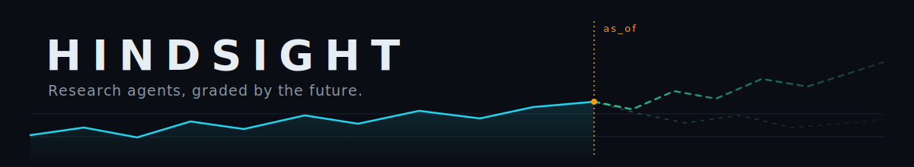
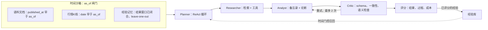
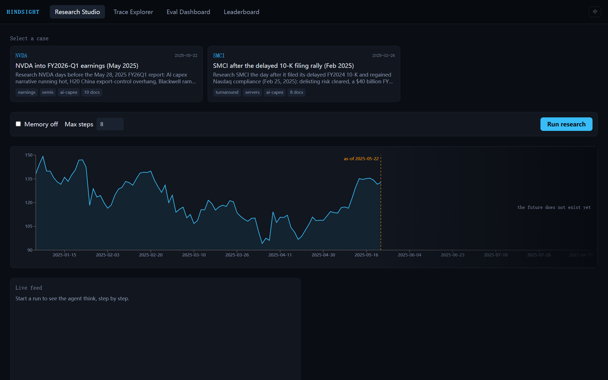
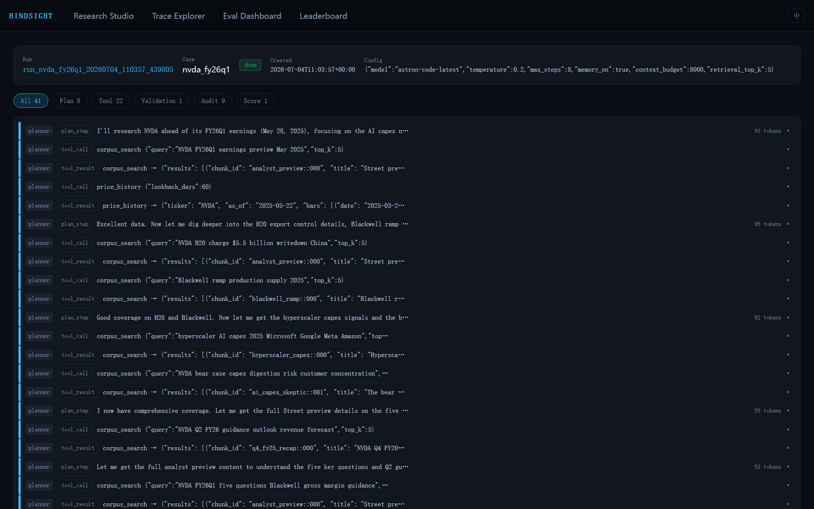
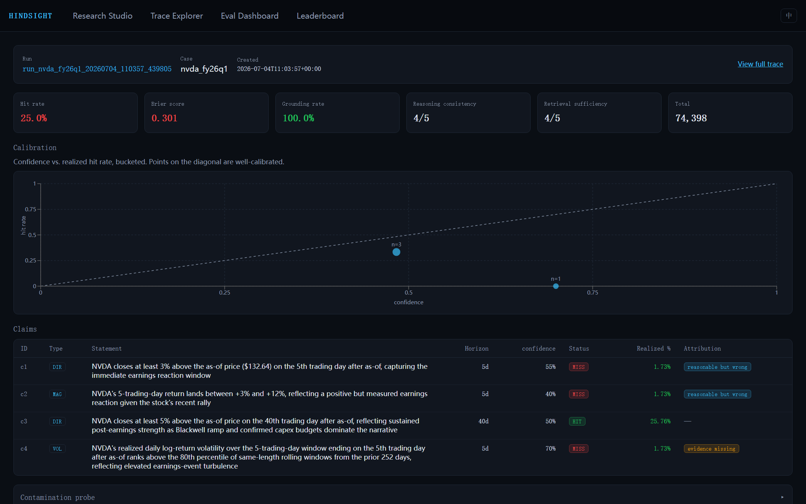
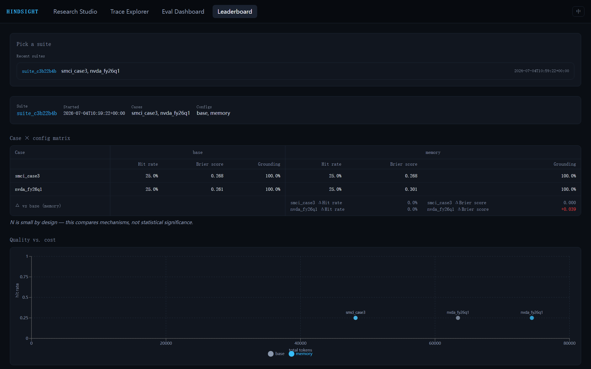

<p align="center">
  
</p>

<p align="center">
  <strong>一个面向深度研究智能体的"时间旅行"评估框架 —— 它产出的每一条论断，都能用之后真实发生的行情数据来证伪。</strong>
</p>

<p align="center">
  <a href="backend/tests"></a>
  <a href="docs/demo-script.md"></a>
  <a href="docs/eval-log.md"></a>
</p>

<p align="center">
  <a href="README.md">English</a> | 中文版
</p>

> 本项目是一个 4 天内完成的面试展示项目 —— 完整的"评估驱动开发"过程记录在 [docs/eval-log.md](docs/eval-log.md)（每一次 prompt / 架构改动都附带前后分数对比）。徽章目前是静态文本，接入 CI 远端后才会换成真实徽章；测试数量可在本地用 `pytest -q` 直接验证。

---

## 为什么做这个

评估一个"深度研究"智能体，通常最后都变成主观品味问题 —— 人读一遍报告，觉得"像那么回事"就算好。金融场景恰好能打破这个僵局："NVDA 在 20 个交易日内收涨 5% 以上"是一条**带日期、可证伪**的论断，市场最终会告诉你它对不对。Hindsight 让一条多智能体研究流水线在过去的某个日期（`as_of`）**"当时"**运行 —— 沙箱从结构上保证智能体看不到该日期之后的任何文档、行情或记忆 —— 然后用真实发生的走势给这些论断打分，把"这个智能体研究得好不好"从一种观点变成一个数字。

## 工作原理



每一次工具调用都会经过沙箱闸门盖章并写入审计日志；一次运行的 `trace.jsonl` 无论是通过 WebSocket 实时观看还是事后从磁盘回放，都是同一份文件 —— 两种模式走同一条代码路径。

## 快速开始

想最快看到整个系统跑起来，**完全不需要 API key** —— 直接回放仓库里已提交的录制运行即可。

```bash
# 1. 后端（在仓库根目录）
cd backend
.venv/Scripts/python -m pip install -e ".[dev]"
$env:HINDSIGHT_OFFLINE = "1"   # PowerShell；bash 下用 `export HINDSIGHT_OFFLINE=1`
.venv/Scripts/python -m uvicorn hindsight.api.app:app --port 8000

# 2. 前端（另开一个终端，在仓库根目录）
cd frontend
npm install
npm run dev
```

打开 `http://localhost:5173`，选一个 case（NVDA 或 SMCI），点 **Run research** —— 在 `HINDSIGHT_OFFLINE=1` 下，后端会从 `llm_calls.sqlite` 即时回放录制好的 LLM 调用（零网络、零计费），所以整套演示 —— 实时流式输出、备忘录 + 论断、"揭晓未来"、Trace Explorer、Eval Dashboard、Leaderboard —— 全部可以离线完成。想接真实模型端点，把 `.env.example` 复制为 `.env`，填上 `LLM_BASE_URL` / `LLM_API_KEY` / `LLM_MODEL` 即可。

两个开发服务器也已配置在 `.claude/launch.json` 里（后端默认带 `HINDSIGHT_OFFLINE=1`），支持读取该文件的工具一键启动。完整的演示动线见 [docs/demo-script.md](docs/demo-script.md)。

## 页面一览

| | |
|---|---|
|  |  |
| **Research Studio** —— 选择 case；价格曲线在琥珀色的 `as_of` 线处戛然而止（"未来尚不存在"）。 | **Trace Explorer** —— 完整的审计轨迹：计划步骤、工具调用与结果、Critic 校验、评分。 |
|  |  |
| **Eval Dashboard** —— hit rate、Brier、grounding、校准图（每个分桶标注 `n`）、逐条论断判定与失败归因、污染探针。 | **Leaderboard** —— 真实评估套件矩阵：各 case 的 base vs memory、配对差值、质量-成本散点图。 |

## 三条防"偷看未来"通道

沙箱的职责，是让智能体从结构上不可能通过任何一扇门看到未来：

- **文档** —— 语料检索强制过滤 `doc.published_at <= as_of`；之后发布的文档对检索是不可见的，而不只是排名靠后。
- **行情K线** —— 行情/成交量工具会拒绝任何时间范围越过 `as_of` 的请求，直接抛出 `LookaheadError`，而不是悄悄截断。
- **经验记忆** —— 跨运行的记忆召回同时要求 `outcome_window_end <= as_of` **且**排除当前 case（leave-one-out），因此一个 case 自己的结局永远不可能泄漏回它自己的运行；一次套件运行也只会读到套件启动之前就已存在的记忆卡片。

这三条通道在 `backend/tests/test_sandbox_leakage.py`（11 个测试）中逐条直接断言 —— 这是 CI 必须永远保持绿色的文件。第四条通道 —— 模型预训练时已经"知道"的东西 —— 沙箱关不掉，只能诚实地暴露：每次运行都会执行一次污染探针（详见 [docs/evaluation-methodology.md](docs/evaluation-methodology.md) §3）。

## 评估

三条评分轨道，在一次运行结束后计算（回测中"未来"早已存在，评分无需等待）：

| 轨道 | 衡量什么 |
|---|---|
| **A. 结果** | 对每条论断（方向 / 幅度 / 波动率）用真实K线做机械化评分 —— hit rate、Brier score、校准图（分桶展示，每桶标注样本量 `n`，绝不画平滑曲线） |
| **B. 过程 + 归因** | 独立的 LLM judge 评估 grounding rate、推理一致性、检索充分性，并给每条**未命中**的论断打上归因标签：`evidence_missing` / `misread_evidence` / `reasonable_but_wrong` |
| **C. 成本** | 按智能体、按步骤的 token 账本、调用次数、每条命中论断的成本 |

另有每个 case 一次的**污染探针**：用一条裸 prompt 直接问模型"`TICKER` 在 `as_of` 之后发生了什么？"—— 结果记录在案并与分数并列展示，作为诚实性检查，不计入分数。两个 case 的探针结果都是干净的（"我不知道之后发生了什么……"）。

完整的评分语义、统计局限、防偷看设计与 judge 有效性，统一收录在 **[docs/evaluation-methodology.md](docs/evaluation-methodology.md)**。judge 本身也被审计过：**[docs/judge-meta-eval.md](docs/judge-meta-eval.md)** 把所有已提交运行中可恢复的 26 条 grounding 判定逐条对照引用证据重新标注 —— 一致率 26/26，但附有诚实的注意事项：样本里所有判定都是 `supported`，因此这只能证明 judge 没有产生假阳性，尚不能说明它有能力抓出真正缺乏证据支撑的论断（扰动测试已列入后续工作）。

## Leaderboard：第一次真实评估套件

Leaderboard 页面背后的数据来自一条命令（`suite_c3b22b4b`，2 个 case × {base, memory} = 4 次运行，新增 30 次计费 LLM 调用，端到端约 6.5 分钟）：

```bash
backend/.venv/Scripts/python -m hindsight.cli suite \
  --cases datasets/smci_case3,datasets/nvda_fy26q1 --presets base,memory
```

| Case | 配置 | Hit rate | Brier ↓ | Grounding | 相对 base 的差值 |
|---|---|---:|---:|---:|---|
| `smci_case3`（as_of 2025-02-26） | base | 0.25 (1/4) | 0.26805 | 1.0 | — |
| `smci_case3` | memory | 0.25 (1/4) | 0.26805 | 1.0 | Δhit 0，Δbrier 0（逐字节一致，见下文） |
| `nvda_fy26q1`（as_of 2025-05-22） | base | 0.25 (1/4) | 0.26125 | 1.0 | — |
| `nvda_fy26q1` | memory | 0.25 (1/4) | 0.30063 | 1.0 | Δhit 0，**Δbrier +0.039（变差）** |

**这张表应该怎么读（以及不该怎么读）：**

- **看配对差值，别看绝对排名。** 每个 Δ 都是同一个 case 在完全相同的冻结语料和K线上对比两种配置 —— 在小样本下，这种配对比较远比任何绝对"分数"可靠。
- **memory 的不对称表现是设计在起作用，不是噪声。** 在 SMCI 的 `as_of`（2025-02-26），没有任何经验卡片能通过时间闸门（唯一另一个 case 的结果窗口 2025-07-22 才闭合，对 SMCI 来说是未来）—— 于是 memory 运行的 planner 提示词与 base **逐字节一致**，所有 LLM 调用全部命中回放缓存，`memo.md` / `claims.json` 与 base 的 sha256 完全相同。而在 NVDA 的 `as_of`（2025-05-22），SMCI 的结果窗口（2025-04-24 闭合）合法通过闸门，已评分的 SMCI 经验被确凿地注入 planner 提示词（该运行时间窗内 13 次计费调用中有 8 次含有 lessons 块，已对照 `llm_calls.sqlite` 核实）。
- **memory 确实改变了输出 —— 而且让 Brier 变差了。** 有了 SMCI 的教训在上下文里，Analyst 的命中论断从 20 日窗口（base："up ≥5%"，实际 +8.54%）换成了 40 日窗口（memory："up ≥5%"，实际 +25.76%），同时抬高了那些依然未命中的 5 日论断的置信度（实际仅 +1.73%）—— 于是 0.30063 对 0.26125。这是一个诚实、未经挑选的 N=1 结果：它证明的是**机制**（时间门控的经验召回确实可测量地改变了规划和论断），而不是 memory 让校准变好或变坏。*N 小是刻意为之 —— 这里比较的是机制，不是统计显著性*（页面矩阵下方渲染的正是这句话）。
- **SMCI 是刻意选择的证伪 case。** 在 SMCI 补交延迟 10-K、股价放量反弹的次日做研究，智能体看多的 20 日论断（"≥5% 以上"）撞上了实际 **-27.53%** 的走势 —— 而它看空的 40 日论断（"≥8% 以下"）则在实际 **-29.94%** 面前命中。这个框架的目的就是在叙事错误时惩罚跟随叙事的行为，这里它做到了。

原始产物：`runs/suites/suite_c3b22b4b.json`（其中列出 `runs/` 下的四个运行目录），以及 [docs/eval-log.md](docs/eval-log.md) 中 "D4 — evaluation suite" 一节。

## 仓库结构

```
hindsight/
├── backend/
│   ├── hindsight/
│   │   ├── agents/        # planner、researcher、analyst、critic、orchestrator
│   │   ├── sandbox/        # gate.py、audit.py、errors.py —— as_of 闸门
│   │   ├── rag/             # 入库、切块、BM25 检索
│   │   ├── tools/           # 行情数据、语料检索、计算器
│   │   ├── eval/             # 结果评分器、judge、校准、套件、污染探针
│   │   ├── memory/         # 经验库
│   │   ├── trace/            # 轨迹记录器、事件类型、成本账本
│   │   ├── llm/                # OpenAI 兼容客户端 + record/replay
│   │   ├── store/            # SQLite（runs、experiences、llm_calls）
│   │   └── api/               # FastAPI 应用、路由、WebSocket 流、套件端点
│   └── tests/                # 170 个测试：沙箱泄漏、评分、schema、回放、API
├── frontend/                # Vite + React + TS + Tailwind + Recharts，深色量化风主题
│   └── src/pages/          # Studio、TraceExplorer、EvalDashboard、Leaderboard
├── datasets/                  # <case_id>/{meta.json, bars.json, docs/*.md} —— 冻结快照
├── runs/                        # 已提交的录制运行 + suites/（可回放，零 key 演示）
├── docs/                        # 方法论、judge 元评估、演示脚本、评估日志、计划
│   └── assets/               # banner 与页面截图
└── .claude/launch.json    # 一键启动前后端开发服务器
```

## 已知局限

- **参数化记忆污染。** 沙箱管住的是*工具层*访问，管不住底层 LLM 预训练时已经"知道"的 `as_of` 之后的事。缓解手段：优先选择接近或晚于模型知识截止日期的 case，加上上文的污染探针；[docs/evaluation-methodology.md](docs/evaluation-methodology.md) §3 解释了为什么被污染 case 的结果分数只应解读为"评分流水线正确性"，而不是"研究能力"。
- **小样本统计。** 两个 case、各四条论断、一次套件 —— 见 Leaderboard 一节的解读框架。同一次运行内的论断彼此相关（同一标的、同一窗口），所以"N 条论断"高估了有效样本量；方法论文档对此有完整论述。
- **judge 的自我偏好。** 过程质量 judge 默认与被评估的智能体同属一个模型家族（可用 `JUDGE_MODEL` 覆盖）。配置间的相对比较比绝对分数更能抵御这种偏差；[docs/judge-meta-eval.md](docs/judge-meta-eval.md) 提供了一致性凭据（26/26），并附单侧样本的注意事项。

## 文档

| 文档 | 内容 |
|---|---|
| [docs/evaluation-methodology.md](docs/evaluation-methodology.md) | 评分语义、统计局限、防偷看通道、judge 有效性、可复现性 |
| [docs/judge-meta-eval.md](docs/judge-meta-eval.md) | judge 与人工的 grounding 标注对照、26/26 一致率、诚实的注意事项 |
| [docs/eval-log.md](docs/eval-log.md) | 评估驱动开发日志 —— 每次改动都附前后分数 |
| [docs/design-decisions.md](docs/design-decisions.md) | 架构取舍、case 数量与置信度的权衡讨论 |
| [docs/demo-script.md](docs/demo-script.md) | 10 分钟离线演示动线与故障预案 |
